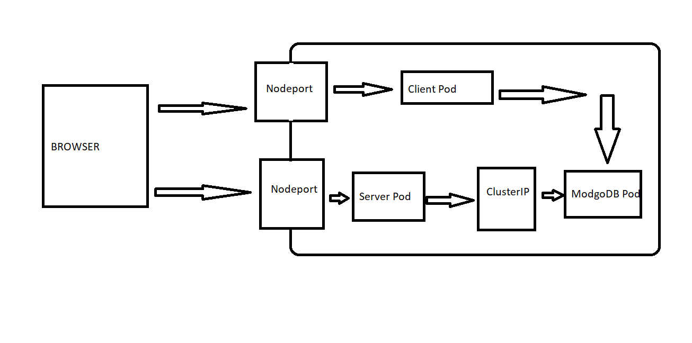

# Git-commands
In this repository, I'll be practicing git commands and following its strategies in order to gave a better knowledge of its use besides I'll be using kubernetes.

Lets start 

If you want to verify you current state, you can use git show command to see it.
When you use git add command, change our file to the stagging area and also you file will be on green which mean
your file is in the staging area

# Architecture of my app

